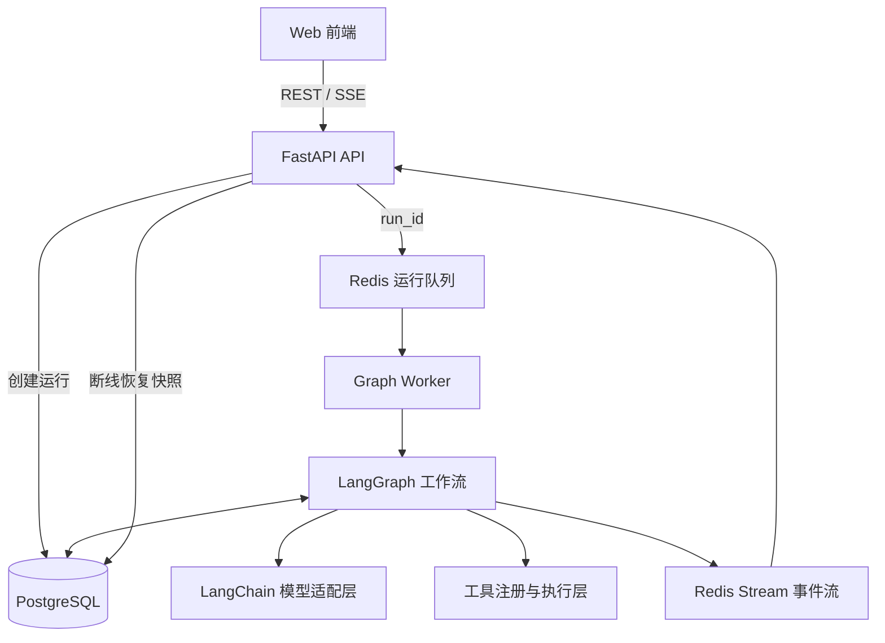
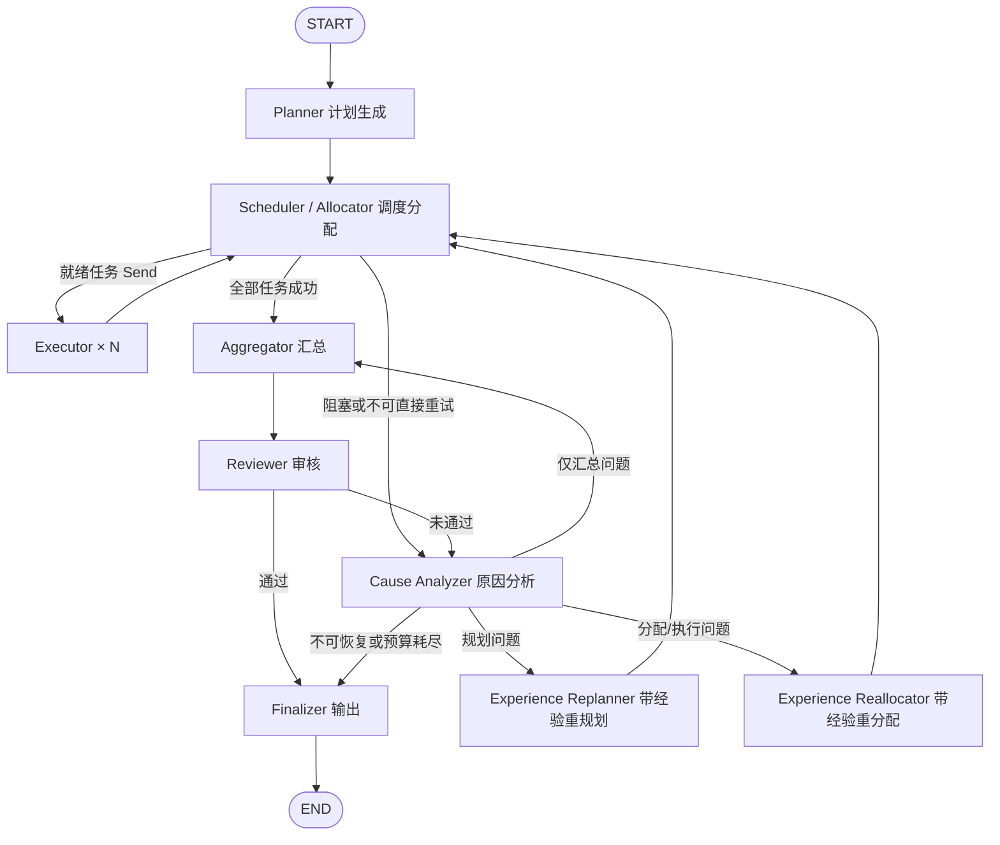

# Open Jarvis Agent 系统架构设计

> 基于 LangChain + LangGraph 的可恢复、多任务 Agent 编排系统。本文对应《流程设计.md》，目标是形成一套可直接进入工程实现、但不过度平台化的设计。

## 1. 目标与边界

### 1.1 建设目标

- 将用户目标拆解为有依赖关系的任务 DAG，并按依赖分波并行执行。
- 对计划、执行结果和最终答案进行结构化审核；失败时能区分规划、调度、执行、工具和数据问题。
- 利用经过验证的历史经验进行重规划或重分配，而不是简单重复调用模型。
- 支持实时进度、取消、超时、失败恢复、审计和有限重试。
- 节点、模型与工具均可替换，先以单体代码库、API/Worker 两类进程部署。

### 1.2 暂不建设

- 通用低代码 Agent 平台、可视化流程编辑器和多租户计费系统。
- 完全自治、无限循环或由模型动态生成并执行任意代码。
- 复杂的 Agent 社交/角色扮演；执行器按能力配置，而非维护大量人格 Prompt。
- 初期引入独立向量数据库、消息中间件或微服务集群。

## 2. 核心设计原则

1. **图负责流程，状态负责事实**：路由由 LangGraph 表达，节点只读取状态并返回增量更新。
2. **计划是 DAG，不是自由文本**：任务必须包含依赖、输入、输出契约和验收条件。
3. **确定性逻辑优先**：依赖解析、预算判断、状态机和错误分类优先用代码；LLM 负责语义规划、综合与评价。
4. **失败必须有界**：每个任务、计划版本和整次运行都有次数、时间与 Token/成本预算。
5. **PostgreSQL 是事实源**：Redis 只承担队列、缓存、取消标记和低延迟事件流，丢失后可由数据库恢复。
6. **经验只能辅助决策**：经验必须可追溯、可降权、可失效，不能覆盖当前事实或用户约束。
7. **大对象不进入图状态**：长文本、文件和二进制产物使用引用，避免 Checkpoint 持续膨胀。

## 3. 总体架构



API 不直接用进程内后台任务长期执行图。`Graph Worker` 与 API 使用同一代码库，可以在开发环境合并运行，但生产环境独立进程部署，避免 API 重启导致任务丢失。

## 4. LangGraph 工作流



### 4.1 分波调度语义

调度节点根据任务依赖计算当前 `ready_tasks`，通过 LangGraph `Send` 动态扇出到多个 Executor。并行结果使用 reducer 追加，所有同批执行分支在下一超级步汇合后再次进入调度节点：

- 存在就绪任务：生成执行分配并并行派发。
- 没有就绪任务且全部成功：进入汇总。
- 没有就绪任务但存在失败、循环依赖或上游阻塞：进入原因分析。
- 尚有运行中任务：等待本批结果，不创建重复执行。

这种“分波执行”既支持 DAG，又比为每个任务动态创建永久图节点简单。初期只实现一个通用 Executor 子图，通过 `executor_profile` 和工具白名单区分能力。

### 4.2 节点职责

| 节点 | 核心职责 | 关键输出 |
| --- | --- | --- |
| Planner | 理解目标、补全假设、生成任务 DAG 与总体验收标准；检索少量相关经验 | `Plan` |
| Scheduler / Allocator | 校验依赖、选择就绪任务、匹配执行器/模型/工具、控制并发和预算 | `Assignment[]` / `Send[]` |
| Executor | 根据单个任务契约调用模型与工具；上报进度；只对瞬时错误做短重试 | `TaskResult` |
| Aggregator | 去重、排序、解析引用并确定性合并任务产物；必要时生成面向审核的候选答案 | `AggregateResult` |
| Reviewer | 按总体与逐任务验收标准检查完整性、正确性、证据和约束 | `ReviewResult` |
| Cause Analyzer | 根据错误、轨迹和审核意见进行结构化归因，选择下一动作 | `Diagnosis` |
| Experience Replanner | 保留仍有效的成功结果，修订任务、依赖或验收条件，递增计划版本 | 新 `Plan` |
| Experience Reallocator | 不改变目标和任务语义，调整模型、工具、执行器、上下文或重试策略 | 新 `Assignment` |
| Finalizer | 生成最终响应；预算耗尽时明确已完成内容、失败项和原因 | `FinalAnswer` |

### 4.3 原因分析与路由

原因分析先使用规则证据，再让 LLM 处理语义歧义，禁止仅凭模型猜测：

| 故障域 | 典型证据 | 动作 |
| --- | --- | --- |
| `planning` | 任务缺失、依赖错误、验收标准与目标不一致 | 重规划 |
| `allocation` | 工具/模型能力不匹配、上下文不足 | 重分配 |
| `execution_transient` | 429、网络错误、工具暂时不可用 | 原分配短重试或延迟重分配 |
| `execution_permanent` | 参数非法、权限不足、工具不支持 | 更换工具/分配；无替代则终止 |
| `data` | 必需输入不存在或来源冲突 | 重规划或返回用户可行动的缺失信息 |
| `review` | 汇总遗漏、格式不合格但原始结果正确 | 重新汇总，避免重跑任务 |

## 5. 核心状态与数据契约

节点间只传结构化对象，建议使用 Pydantic v2 定义边界模型，`TypedDict + Annotated reducer` 定义 LangGraph 状态。

```python
class RunState(TypedDict):
    run_id: str
    user_request: str
    plan: Plan | None
    plan_version: int
    task_events: Annotated[list[TaskResult], add_task_results]
    assignments: dict[str, Assignment]
    aggregate: AggregateResult | None
    review: ReviewResult | None
    diagnosis: Diagnosis | None
    budget: RunBudget
    cycle_count: int
    final_answer: FinalAnswer | None
```

并行 Executor 不直接修改共享的 `tasks` 字典，以免发生并发写冲突；它只追加不可变 `TaskResult`。Scheduler 根据事件归并出任务最新状态。

### 5.1 计划模型

```text
Plan
├─ plan_id / version / objective
├─ assumptions[] / global_success_criteria[]
└─ tasks[]
   ├─ task_id / title / instruction
   ├─ dependencies[]
   ├─ required_capabilities[] / tool_allowlist[]
   ├─ input_refs[] / output_schema
   ├─ success_criteria[]
   └─ timeout_seconds / max_attempts
```

任务 ID 在同一计划版本内稳定。重规划时记录旧、新任务映射；仅当输入和验收条件仍兼容时复用已成功结果。

### 5.2 执行与审核模型

- `Assignment`：`task_id`、执行器配置、模型档位、工具白名单、解析后的输入引用、超时和尝试号。
- `TaskResult`：状态、结构化输出、产物引用、错误码、开始/结束时间、Token/费用、所用工具和尝试号。
- `ReviewResult`：`passed`、评分、失败任务、问题列表、证据引用、建议动作。
- `Diagnosis`：故障域、置信度、证据、建议动作、可复用成功任务、引用的经验 ID。
- `FinalAnswer`：用户可见内容、完成状态（成功/部分成功/失败）、产物引用和必要告警。

不要持久化或向前端输出模型的隐式思维链；只保留简短、结构化、可审计的决策依据和证据引用。

## 6. 执行器与工具层

Executor 建议实现为小型子图：

```text
prepare_context → agent/model → tool_call（可循环、有上限）→ validate_output
```

- 工具统一注册为 `ToolSpec`：名称、说明、JSON Schema、权限等级、超时、是否幂等、结果大小上限。
- 执行前同时校验计划白名单、执行器白名单和运行身份权限。
- 工具调用使用 `run_id + task_id + attempt + call_index` 作为幂等键；非幂等操作默认需要显式授权策略。
- 对工具输出做截断、脱敏和内容类型校验；大结果写入产物存储，仅返回引用与摘要。
- 瞬时错误可在 Executor 内指数退避重试 1～2 次；语义错误交还图级原因分析，避免嵌套重试失控。
- 模型通过 LangChain 接口适配，按 `fast / standard / reasoning` 三档配置，业务代码不绑定具体厂商。

## 7. 经验机制

经验不是整段历史对话，而是一次已审核运行沉淀出的结构化记录：

```text
Experience
├─ scope / problem_fingerprint / task_pattern
├─ fault_domain / symptoms[] / root_cause
├─ successful_action / constraints
├─ evidence_refs[] / source_run_id
├─ confidence / success_count / failure_count
└─ created_at / last_used_at / expires_at
```

### 7.1 检索与使用

- Planner：按目标、领域和约束检索成功规划经验。
- Replanner：按故障域和计划形态检索修复经验。
- Reallocator：按能力、工具错误码和任务类型检索执行经验。
- PostgreSQL 使用 `pgvector`（可选扩展）完成语义召回，并叠加故障域、工具、租户等结构化过滤；初期无需独立向量库。
- 每次最多注入 3～5 条摘要，记录采用或拒绝原因及 `experience_id`。

### 7.2 写入与治理

- 只有通过审核，或失败但根因证据充分的运行才生成候选经验。
- 相同模式合并计数而非重复写入；后续使用失败会降低置信度。
- Prompt 中明确经验是参考信息，当前用户约束、工具事实和新证据优先。
- 支持过期、禁用和按租户/项目隔离，防止陈旧经验及跨域污染。

## 8. 持久化与恢复

### 8.1 PostgreSQL

| 数据 | 建议表/机制 | 用途 |
| --- | --- | --- |
| 图快照 | LangGraph PostgreSQL Checkpointer 管理表 | 从节点边界恢复执行 |
| 运行 | `agent_run` | 请求、状态、预算、当前计划版本、最终结果 |
| 计划与任务 | `agent_plan`、`agent_task` | 前端查询、版本对比和审计 |
| 尝试与审核 | `task_attempt`、`agent_review` | 错误证据、指标和质量记录 |
| 经验 | `agent_experience` | 检索、置信度及来源追踪 |
| 事件 | `run_event` | 带递增序号的关键事件，用于恢复与审计 |
| 产物元数据 | `agent_artifact` | 文件/长结果的类型、摘要、校验值与存储引用 |

Checkpoint 用于图恢复，业务表用于查询和审计，两者不要互相替代。所有写入携带 `run_id`，任务尝试使用 `(run_id, plan_version, task_id, attempt)` 唯一键保证幂等。

小型结构化结果可保存在 PostgreSQL `jsonb` 字段；确有文件或大文本场景时再接入 S3/MinIO 兼容对象存储，数据库只保留引用。首版没有此类场景可暂不部署对象存储。

### 8.2 Redis

- `run_queue`：Worker 消费组领取待运行任务。
- `run:{id}:events`：短期 Redis Stream，供 SSE 低延迟转发。
- `run:{id}:cancelled`：带 TTL 的协作式取消标记。
- 计划快照和运行状态短缓存，缓存失效时回源 PostgreSQL。
- 分布式并发配额/信号量，限制全局及单次运行并行数。

Worker 使用 `run_id` 作为 LangGraph `thread_id`。进程异常后由租约/心跳回收运行，读取最近 Checkpoint 继续；已经成功写入的幂等任务不会重复产生副作用。

## 9. API 与事件协议

建议以 `/api/v1` 作为版本前缀：

| 接口 | 作用 |
| --- | --- |
| `POST /runs` | 创建运行；支持 `Idempotency-Key` |
| `GET /runs/{run_id}` | 查询状态、预算和最终结果 |
| `GET /runs/{run_id}/plan` | 获取当前计划、任务状态及版本 |
| `GET /runs/{run_id}/events` | SSE 实时事件；支持 `Last-Event-ID` |
| `POST /runs/{run_id}/cancel` | 发起协作式取消 |

SSE 事件统一使用以下信封：

```json
{
  "event_id": 42,
  "run_id": "run_xxx",
  "type": "task.completed",
  "timestamp": "2026-07-17T13:00:00Z",
  "data": {"task_id": "t2", "attempt": 1}
}
```

事件类型保持少而稳定：`run.*`、`plan.*`、`task.started/progress/completed/failed`、`review.completed`、`output.delta`。断线重连先从 PostgreSQL 返回状态快照，再从指定事件序号续传；Redis 中已过期的事件可由 `run_event` 补齐。

取消是协作式的：API 写取消标记，Scheduler 和 Executor 在模型/工具调用前后检查；不可中断的外部调用完成后丢弃后续结果并进入 `cancelled`。运行状态变更使用有限状态机，终态不可回退。

## 10. 预算、可靠性与安全

### 10.1 默认保护阈值

阈值全部配置化，建议初始值：

- 单次运行最多 3 个计划版本、3 次审核闭环。
- 单任务最多 2 次图级尝试，工具内部瞬时重试最多 2 次。
- 单次运行并发任务默认 4，总时长默认 15 分钟。
- 同时限制模型调用次数、Token 和预估费用；任一预算耗尽即进入降级汇总。

### 10.2 可靠性

- 节点以重放安全为目标；外部副作用必须有幂等键或操作前查询。
- 每个模型、工具和节点都有超时，错误使用稳定错误码而非只保存异常文本。
- Planner 输出后执行 DAG 校验：任务数、未知依赖、自依赖、环、孤立输出、工具权限和 Schema。
- Reviewer 使用独立提示词；高风险场景可配置不同模型，降低同源偏差。
- 达到上限时仍由 Finalizer 返回部分结果、失败任务和可行动建议，不能静默结束。

### 10.3 安全

- 用户输入、网页/文件内容和工具返回均视为不可信数据，防止其中指令提升工具权限。
- 工具遵循最小权限；写操作、网络访问、代码执行按风险分级，预留 LangGraph `interrupt` 人工确认点。
- 密钥只从环境变量或密钥服务注入，不进入 Prompt、Checkpoint、日志和 SSE。
- 日志和经验入库前脱敏；按用户/租户校验每个 `run_id` 和产物引用的访问权限。

## 11. 可观测性

- 统一关联字段：`trace_id`、`run_id`、`plan_version`、`task_id`、`attempt`、`node`。
- 指标：运行成功率/部分成功率、端到端耗时、节点耗时、任务重试率、审核一次通过率、经验命中及采纳率、Token/费用、队列积压。
- 使用 OpenTelemetry 输出日志、指标和 Trace；开发调试可接入 LangSmith，生产环境按数据合规要求启用。
- 面向用户的进度事件与内部调试 Trace 分离，SSE 不暴露 Prompt、密钥、完整工具响应和模型思维链。

## 12. 推荐工程结构

```text
open-jarvis/
├─ app/
│  ├─ api/                 # FastAPI 路由、SSE、鉴权
│  ├─ graph/
│  │  ├─ builder.py        # StateGraph 构建与条件路由
│  │  ├─ state.py          # RunState 与 reducers
│  │  ├─ nodes/            # planner/scheduler/executor/...
│  │  └─ prompts/          # 版本化 Prompt 模板
│  ├─ domain/              # Plan、Task、Review、Experience 模型
│  ├─ tools/               # 工具注册、权限、执行与适配器
│  ├─ models/              # LLM 配置与模型路由
│  ├─ repositories/        # PostgreSQL / Redis 访问
│  ├─ services/            # run、event、artifact、experience 服务
│  ├─ worker/              # 队列消费、恢复、心跳
│  └─ observability/
├─ migrations/             # Alembic
├─ tests/
│  ├─ unit/                # 节点、路由、DAG、reducer
│  ├─ integration/         # PostgreSQL、Redis、工具适配
│  └─ scenarios/           # 端到端固定场景与质量回归
└─ pyproject.toml
```

建议基础技术栈：Python 3.12、FastAPI、LangChain、LangGraph、Pydantic v2、PostgreSQL、Redis、SQLAlchemy 2.x/Alembic、OpenTelemetry。依赖锁定具体小版本，并在升级 LangGraph 时运行图路由与恢复测试。

## 13. 测试与验收

- **单元测试**：DAG 校验、ready task 计算、reducer 并发归并、预算和路由边界。
- **节点契约测试**：用固定 LLM 响应验证每个节点的输入输出 Schema 与错误回退。
- **图场景测试**：正常并行、依赖任务、工具瞬时失败、规划错误、审核失败、预算耗尽和取消。
- **恢复测试**：在每个节点后强制终止 Worker，验证从 Checkpoint 恢复且无重复副作用。
- **API 测试**：幂等创建、SSE 顺序与重连、权限隔离、终态不可回退。
- **质量回归集**：保存一组代表性目标，只比较结构化结果和评分，不依赖完整自然语言逐字一致。

首版达到以下条件即可认为不是 Demo：Worker 重启可恢复；任务副作用幂等；SSE 可重连；失败有稳定错误码；循环有预算上限；关键图路径有自动化测试。

## 14. 实施顺序

1. **骨架闭环**：状态模型、Planner、Scheduler、单一 Executor、Aggregator、Reviewer、内存 Checkpointer，使用假工具跑通图测试。
2. **持久与服务化**：PostgreSQL Checkpointer、业务表、Redis 队列/事件、独立 Worker、REST/SSE、取消与恢复。
3. **失败自愈**：Cause Analyzer、Replanner、Reallocator、预算控制和部分成功输出。
4. **经验与治理**：经验候选、审核后写入、检索与效果指标，再按实际召回量决定是否启用 `pgvector`。
5. **生产加固**：权限分级、幂等副作用、可观测性、故障注入和质量回归。

## 15. 可借鉴的开源设计

- [LangGraph](https://github.com/langchain-ai/langgraph)：状态图、Checkpoint、`Send` 动态并行和 `interrupt` 人工介入。
- [OpenHands](https://github.com/All-Hands-AI/OpenHands)：动作/观察事件、工具执行隔离和可恢复会话的工程思路。
- [Microsoft AutoGen](https://github.com/microsoft/autogen)：Agent 能力边界、消息化协作和运行时抽象。
- [MetaGPT](https://github.com/FoundationAgents/MetaGPT)：结构化中间产物与审核角色，但本项目不照搬其多角色组织复杂度。

借鉴重点应是状态、事件、边界与恢复机制，而不是增加 Agent 数量。首版维持一个主图、一个通用 Executor 子图和少量明确节点，后续只在真实瓶颈出现时拆分。
